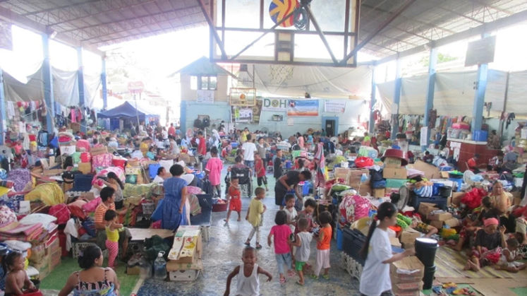

### Cultural Identity - What Does It Mean to Be Filipino?

Learn about the diversity of Filipino identity, from regional traditions to indigenous communities, and how history has shaped the nation.

- **Unity in Diversity**

Filipino identity is not a single uniform culture. The Philippines is an archipelago with many regions, languages, and traditions, but Filipinos still share a sense of belonging to one *bayan* (nation or community). The word *kababayan*, for example, shows how Filipinos extend friendship and shared identity to one another even across regions.

- **Community and Cooperation (Bayanihan)**

One key Filipino value is *bayanihan*, which refers to helping one another without expecting anything in return. Historically, this was symbolized by neighbors physically carrying a traditional house to help a family move. Today, it shows up in daily life through shared support during celebrations, disasters, and everyday tasks.

- **Family-Centered Culture**

Family is central to Filipino identity. Many Filipinos grow up in close-knit households where grandparents, parents, siblings, and extended relatives play active roles in upbringing, celebrations, and support systems. This deep sense of *pamilya first* is a cornerstone of what many consider Filipino identity.

- **Respect and Social Values**

Filipino culture places strong emphasis on respect for elders and others. For example, the gesture *mano*, where a younger person gently touches an elder’s hand to their forehead as a sign of respect, is a common tradition throughout the country.

**Pakikisama** – *getting along with others and building harmonious relationships.*

**Utang na loob** – *deep gratitude and a sense of heartfelt loyalty towards someone who has helped you.*

- **Food and Everyday Life**

Filipino identity shows up in everyday things like food. Filipino cuisine blends native, Spanish, Chinese, and other influences into dishes like *adobo*, *sinigang*, and *lechon* that are recognized as part of the national heritage. Food brings families and communities together, expressing identity through shared meals and traditions.

- **Resilience, Adaptability, and Global Influence**

Being Filipino also means adapting while still holding onto cultural roots. Filipinos are known for resilience—finding strength and joy even through challenges. Abroad, many Filipinos embrace their culture while also contributing in diverse societies, showing that cultural identity can grow and still stay meaningful.

